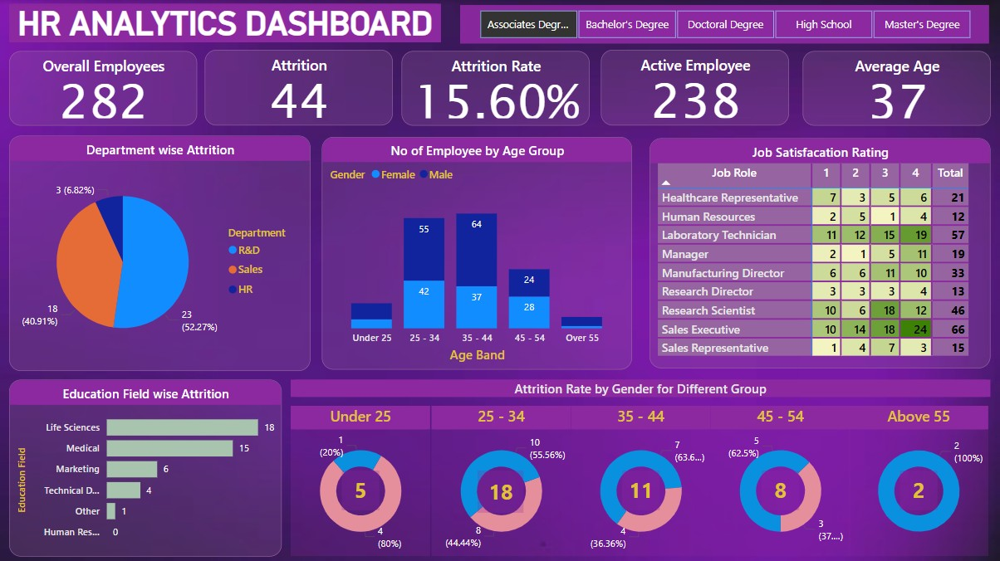

# HR Analytics Dashboard - Power BI

## Overview
This Power BI dashboard provides insights into **HR analytics**, including attrition trends, job satisfaction ratings, and employee demographics.

## Key Features:
- **Attrition Analysis**: Attrition rate by department, age group, and education field.
- **Employee Demographics**: Breakdown by gender, age group, and education level.
- **Job Satisfaction Ratings**: Analyzed across different job roles.
- **Interactive Visuals**: Pie charts, bar graphs, and dynamic filters for better insights.

## Tools Used:
- **Power BI** (Data Visualization)
- **DAX** (Calculated Measures)
- **SQL/Excel** (Data Cleaning & Preparation)

## Screenshot:

## How to Use:
1. Download the `.pbix` file.
2. Open it in **Power BI Desktop**.
3. Interact with the visuals to explore HR insights.

## Contact:
For any queries, reach out via [LinkedIn](https://www.linkedin.com/in/sujeetdatascience1/).

